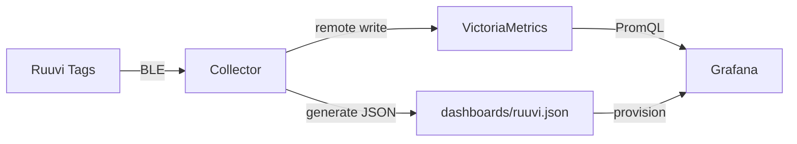

# Ruuvi Dashboard

Self-hosted monitoring for [Ruuvi](https://ruuvi.com/) BLE sensor tags with a Python collector, VictoriaMetrics for storage, and auto-generated Grafana dashboards — all running in Docker on a Raspberry Pi or any Linux host.

## Architecture



## Features

- **Auto-discovery** — scans for nearby Ruuvi tags and shows unregistered ones in the admin UI
- **Live readings** — temperature, humidity, pressure, battery voltage, RSSI, and movement counter
- **Generated Grafana dashboard** — built automatically from tag config; no manual Grafana editing
- **Drag-and-drop ordering** — reorder tags in the admin UI; Grafana updates within 30 seconds
- **Dark / light theme** — admin UI follows system preference or can be toggled manually
- **Hot-reload config** — edit `config.yaml` on disk and changes apply without restart

## Prerequisites

- Raspberry Pi or Linux host with Bluetooth (BLE)
- Docker and Docker Compose
- One or more [Ruuvi sensor tags](https://ruuvi.com/)

## Quick Start

```bash
git clone https://github.com/Tiaxi/ruuvi-dashboard.git
cd ruuvi-dashboard

cp .env.example .env          # all settings have sensible defaults
cp config/config.yaml.example config/config.yaml

docker compose up -d --build

# Open the admin UI at http://<host>:8000
```

On first start with no tags configured, the Grafana dashboard will show empty graph sections.
Add tags via the admin UI — they appear in the dashboard within 30 seconds.

## Configuration

### Environment Variables (`.env`)

| Variable | Default | Description |
|---|---|---|
| `DASHBOARD_TITLE` | `Ruuvi Dashboard` | Dashboard title in Grafana and browser tab |
| `GRAFANA_SUBPATH` | *(empty)* | Serve Grafana under a subpath (e.g. `/grafana/`) for reverse proxies |
| `ADMIN_PORT` | `8000` | Host port for the admin UI |
| `GRAFANA_PORT` | `3000` | Host port for Grafana |
| `GF_ADMIN_PASSWORD` | `admin` | Grafana admin password (only used on first start) |
| `VM_RETENTION` | `1y` | VictoriaMetrics data retention period |

### Tag Config (`config/config.yaml`)

```yaml
tags:
  - mac: "AA:BB:CC:DD:EE:FF"
    name: "Living Room"
  - mac: "11:22:33:44:55:66"
    name: "Kitchen"
    enabled: false          # optional, defaults to true

collector:
  # min_write_interval_seconds: 60   # optional write throttle
  victoriametrics_url: "http://victoriametrics:8428"
```

Tags can also be added, renamed, reordered, and deleted through the admin UI — changes are saved to `config.yaml` automatically.

## Admin UI

The collector serves a web UI on port 8000 (configurable via `ADMIN_PORT`):

- **Configured Tags** — live readings, enable/disable, edit, delete, and drag-and-drop reordering
- **Discovered Tags** — unconfigured tags detected nearby, with one-click add
- **Database** — VictoriaMetrics storage statistics
- **Settings** — write interval configuration

## Grafana Dashboard

The dashboard is generated automatically from your tag configuration and written to `./dashboards/ruuvi.json`. Grafana picks up changes within 30 seconds.

- **Temperature** and **Humidity** stat panels — one per tag, in config order
- **History** graphs — temperature, humidity, and pressure over time
- **Extra** graphs — battery voltage, RSSI, movement counter, measurements per hour

## Development

```bash
cd collector
uv sync --dev
uv run pytest -v
uv run ruff check src/ tests/
```

## Project Structure

```
ruuvi-dashboard/
├── collector/
│   ├── src/
│   │   ├── api.py            # FastAPI admin API + static file serving
│   │   ├── config.py         # YAML config, file watcher, readings store
│   │   ├── dashboard.py      # Grafana dashboard JSON generator
│   │   ├── decoder.py        # RuuviTag RAWv2 BLE payload decoder
│   │   ├── main.py           # Entry point, orchestrates all components
│   │   ├── scanner.py        # BLE scanner (bleak)
│   │   └── writer.py         # Prometheus remote write to VictoriaMetrics
│   ├── static/
│   │   └── index.html        # Admin UI (single-page, vanilla JS)
│   ├── tests/
│   ├── Dockerfile
│   └── pyproject.toml
├── config/
│   ├── config.yaml.example
│   └── config.yaml           # your tag config (gitignored)
├── dashboards/               # generated dashboard JSON (gitignored)
├── grafana/
│   └── provisioning/         # datasource + dashboard provider config
├── docker-compose.yml
├── .env.example
└── .env                      # your settings (gitignored)
```

## License

[MIT](LICENSE)
